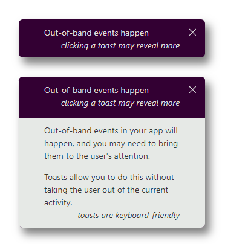
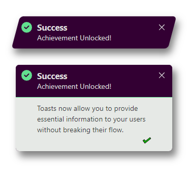
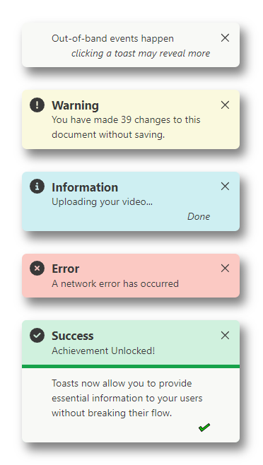
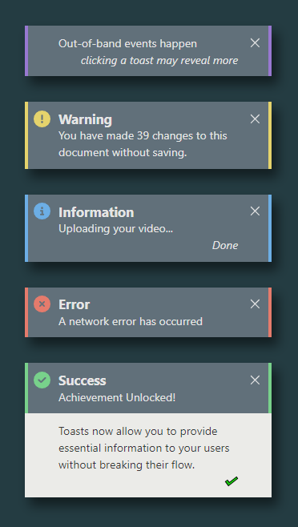
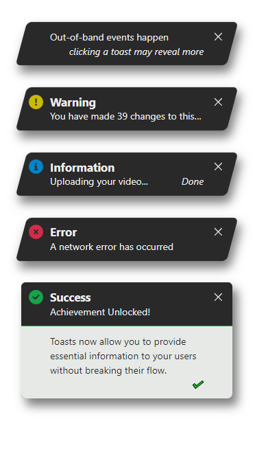

<!--
**💛 You can help the author become a full-time open-source maintainer by [sponsoring him on GitHub](https://github.com/sponsors/kevin-in-code).**

---

-->

# @in-code/svelte-toasts

[](https://npm.im/@in-code/signal-effects) [](https://npm.im/@in-code/svelte-toasts)

A neat, feature rich and customisable implementation of toasts in svelte.

 

## Installation

```bash
npm i @in-code/svelte-toasts
```

<!--
## Sponsors

[](https://github.com/sponsors/kevin-in-code)
-->

## Usage

```typescript
<script>
  import { ToastView, raiseToast, candy as theme } from '@in-code/svelte-toasts';

  function giveBlessing() {
    raiseToast({
      topic: 'May your troubles be less, and your blessings be more',
      body: [
        'May your troubles be less, and your blessings be more.',
        'And nothing but happiness come through your door.',
      ],
      status: {
        expanded: 'An Irish blessing',
      },
    });
  }
</script>

<ToastView {theme} />
<button on:click={giveBlessing}>Raise Toast!</button>
```

## Themes & Designs

Four themes are provided to give a good selection of default colour options. These themes are _marker_, _candy_, _crisp_, and _chalk_. All of these can serve well in light an dark settings, but some may be better suited to one or the other.

Toast design selection is separate from theme selection. There are three standard designs: the _classic_ design with its elegant use of colour and rounded corners, _formal_ with austere squared edges, and _action_ with its compact slanted aspect to evoke interest. All of the designs support keyboard interaction, and have a suitable visual style for showing which element has keyboard focus.

Some examples are shown below. The project includes a demo application that may be useful for visual elements further.

  

## License

MIT &copy; [kevin-in-code](https://github.com/sponsors/kevin-in-code)
