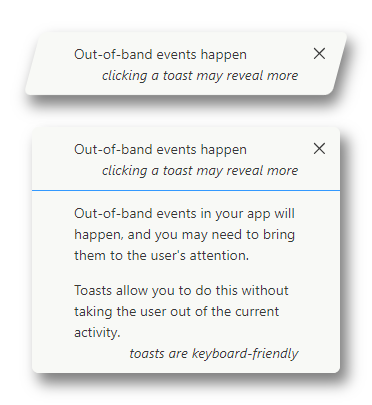
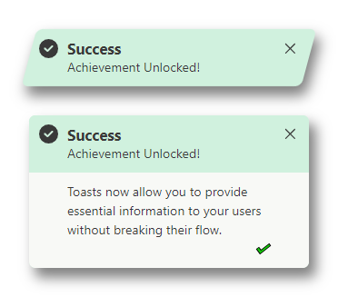
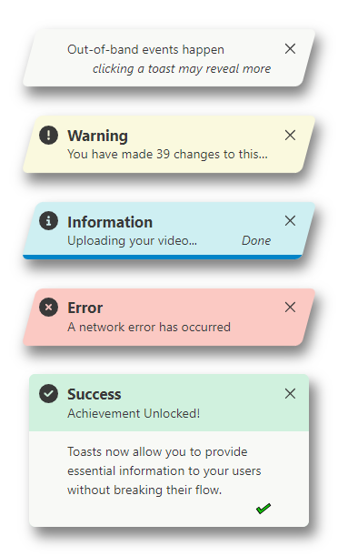
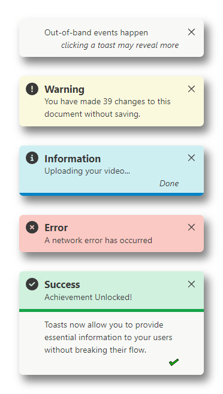
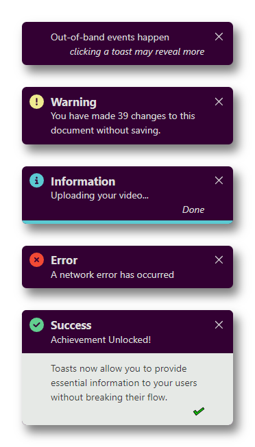
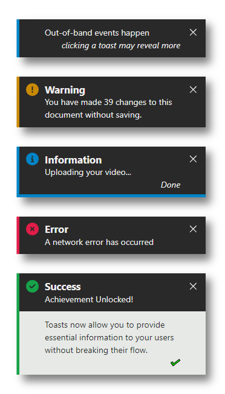

<!--
**💛 You can help the author become a full-time open-source maintainer by [sponsoring him on GitHub](https://github.com/sponsors/kevin-in-code).**

---

-->

# @in-code/svelte-toasts

[](https://npm.im/@in-code/signal-effects) [](https://npm.im/@in-code/svelte-toasts)

A neat, feature rich and customisable implementation of toasts in svelte.

 

## Installation

```bash
npm i @in-code/svelte-toasts
```

<!--
## Sponsors

[](https://github.com/sponsors/kevin-in-code)
-->

## Usage

```typescript
<script>
  import { ToastView, raiseToast, candy as theme } from '@in-code/svelte-toasts';

  function giveBlessing() {
    raiseToast({
      topic: 'May your troubles be less, and your blessings be more',
      body: [
        'May your troubles be less, and your blessings be more.',
        'And nothing but happiness come through your door.',
      ],
      status: {
        expanded: 'An Irish blessing',
      },
    });
  }
</script>

<ToastView {theme} />
<button on:click={giveBlessing}>Raise Toast!</button>
```

## Themes

Four themes are provided: _action_, _marker_, _candy_ and _crisp_. The _action_ and _marker_ designs are light and visually similar themes. _Action_ evokes more visual interest with its slanted design at the expense of occassionally contracted text, whereas _marker_ is straightforward and does not constrain topic text in its collapsed view. The two remaining themes, _candy_ and _crisp_ are more distinct. All of the designs support keyboard interaction, and have a suitable visual style for showing which element has keyboard focus.

 

 

Some visual elements of the _crisp_ theme design are inspired from the flat design of [@mzohaibqc/svelte-toasts](https://github.com/mzohaibqc/svelte-toasts). Although similar, @in-code/svelte-toasts and @mzohaibqc/svelte-toasts are independent and each has distinguishing features. It may be valuable to compare the libraries to determine which is more suitable for a given project.

## License

MIT &copy; [kevin-in-code](https://github.com/sponsors/kevin-in-code)
